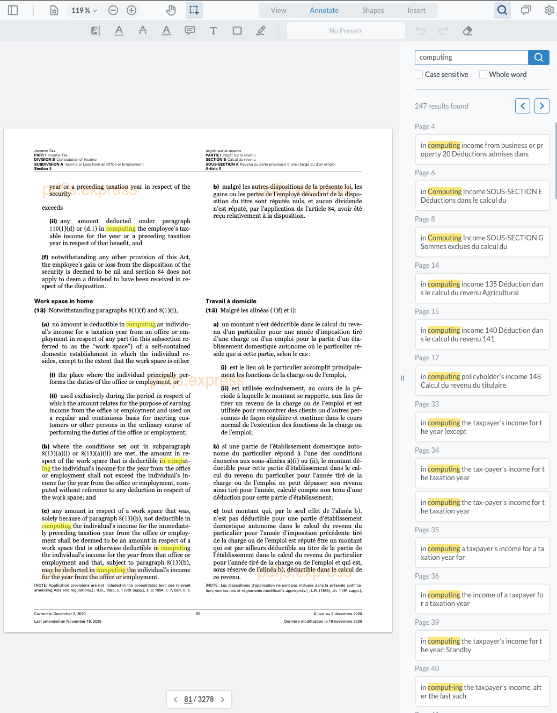

# PDF-SDK-Evaluation-2021
### react-pdf vs. pdf.js vs. pdfjs.express vs. pdftron

Web developers have quite a few options for adding a PDF renderer to their web application and evaluating these options can be time-consuming. Here is a guide with samples that compares several PDF library options.

Watch the presentation and the overview for this repo on [YouTube](https://youtu.be/rGTrcN69LR8). 

## Table of Contents

* [Adding PDF Support In A Web Application In 2021](#adding-pdf-support-in-a-web-application-in-2021)
  + [Downloading or Opening PDFs In A New Tab](#downloading-or-opening-pdfs-in-a-new-tab)
  + [Create A Viewer From Scratch](#create-a-viewer-from-scratch)
  + [Leverage An Existing Viewer](#leverage-an-existing-viewer)
* [Let's evaluate a few viewers](#let-s-evaluate-a-few-viewers)
  * [React-PDF](#react-pdf)
    + [Installation](#installation)
    + [First impressions](#first-impressions)
  * [PDF.js](#pdfjs)
    + [Installation](#installation-1)
    + [First impressions](#first-impressions-1)
  * [PDF.js Express](#pdfjs-express)
    + [Installation](#installation-2)
    + [First impressions](#first-impressions-2)
  * [PDFTron WebViewer](#pdftron-webviewer)
    + [Installation](#installation-3)
    + [First impressions](#first-impressions-3)

### Adding PDF Support In A Web Application In 2021

#### Downloading or Opening PDFs In A New Tab

Pros
+ no work required

Cons
- we cannot control or enforce any retention policies on the file
- if the document has sensitive information, PDF security alone would not be sufficient (PDF encryption and PDF do not print flags, content copy, extraction)
- rendering of the content could be different across browsers
- comments or annotations will not be shown

#### Create A Viewer From Scratch

Pros
+ you are starting a PDF company

Cons
- interpreting PDF Specification or ISO 32000-2:2020 with 986 pages
- cannot account for all corner cases and poorly generated PDFs
- will need a lot of resources to support it

#### Leverage An Existing Viewer

The amount of features and effort required to get an existing viewer up and running can vary greatly. Some things to consider are:

- Is rendering consistent between browsers
- How much time and effort does it take to integrate the viewer into an existing web application
- Does the viewer support annotations, and if so, does it conform with the PDF specification of representing them as an XFDF
- Does the look and feel conform with your web application's styling? If not, how easy is it to customize the UI?
- Does the viewer have a support team for:
  * Answering questions about the integration process
  * Maintaining the library for when browsers are updated
  * Fixing potential rendering issues
## Let's evaluate a few viewers

Since there are so many PDF library options, I picked several and will try to highlight the most common gotchas. For all apps, I ran `npx create-react-app my-pdf-app` and followed the documentation.

### React-PDF

[React PDF](https://www.npmjs.com/package/react-pdf) is one of the more popular libraries out there. It leverages [PDF.js](https://mozilla.github.io/pdf.js/) under the hood and provides ready to go components like `Document` or `Page`.

#### Installation

Documentation is available through [npm](https://www.npmjs.com/package/react-pdf) and [GitHub](https://github.com/wojtekmaj/react-pdf).

```
npm i react-pdf
```

#### First impressions

For some reason, after trying to load my files, I was faced with `Failed to load PDF file`. Checking the console did not yield anything fruitful. Reading documentation further, it seems like I have to host my `PDF.js` worker elsewhere and it was not a plug-n-play solution as I initially hoped. After some time, I was able to get started and render out the first page!


However, the text layer was off. At first, it is easy to think there's a CSS issue happening, but a quick search reveals this is a known [issue](https://github.com/wojtekmaj/react-pdf/issues/332) from 2019. @nikonet saved the day with his [fix](https://github.com/wojtekmaj/react-pdf/issues/332#issuecomment-458121654). Not an official fix, but oh well.


Selecting text is a bit of a nightmare, but this is not coming from `react-pdf` but is coming from `PDF.js` and is a known issue.


Searching for any words that have a break in them, does not return the results. There is a [closed issue](https://github.com/wojtekmaj/react-pdf/issues/189) for searching in general where Wojciech reiterates that:

> React-PDF does not aim to be a fully fledged PDF reader, 
> it only gives you an easy way to display PDFs so that you can build some UI around it. 
> You can highlight some words in the text using custom text renderer.

Pros
+ an impressive project by [Wojciech Maj](https://wojtekmaj.pl/)
+ simple enough to get started
+ frequent commits and updates
+ it is free

Cons
- no out-of-the-box UI, so an additional time cost should be considered
- a lot of common issues or gotchas that are not mentioned in docs or resolved in issues
- still plagued by a lot of issues due to PDF.js dependency, for example, when trying to select text

### PDF.js

Perhaps the most popular open-source viewer out there is [PDF.js](https://mozilla.github.io/pdf.js/) that is powering `React-PDF` project. 

#### Installation

Documentation is available on the project's [website](https://mozilla.github.io/pdf.js/examples/). 

Download the [latest build](https://mozilla.github.io/pdf.js/getting_started/#download) and place the extracted into `public/lib`. 

#### First impressions

Installation is fairly straight forward. PDF.js allows us to build our custom UI as well as leverage an existing UI provided by Mozilla. However, it is still plagued by numerous issues like searching, limited zoom capability and others. Currently, there 582 issues are open on [GitHub](https://github.com/mozilla/pdf.js/issues).

Pros
+ out of the box UI
+ simple to get started
+ it is free

Cons
- no UI npm package
- UI customization is not available via APIs
- selection issues
- search issues

### PDF.js Express

[PDF.js Express](https://pdfjs.express/) is a new player that provides an out of the box UI and annotation support on top of `PDF.js` rendering. 

#### Installation

Documentation and samples are available through [npm](https://www.npmjs.com/package/@pdftron/pdfjs-express) and [website](https://pdfjs.express/documentation/get-started).

```
npm i @pdftron/pdfjs-express
```

After installing, you will need to copy the static files located in `node_modules/@pdftron/pdfjs-express/public` into a place that will be served alongside your other website files.

In the sample, I added a handy `postinstall` script in `package.json`.

#### First impressions

Getting started was much quicker, thanks to good guides. The UI and annotations were available straight out of the box as well. The selection is accurate and does not flash even though it also uses `PDF.js` under the hood. The text selected did run off the page a bit though but overall it is an improvement.


The searching was problematic in both libraries, but `PDF.js Express` addresses it better with the ability to pick up words with a break in between, however, `PDF.js` still returns incorrect search box positions. 



Pros
+ simple to get started
+ tons of guides and samples
+ annotations and UI is available out of the box
+ UI is available on GitHub and written in React

Cons
- still leverages PDF.js which comes with its own problems

### PDFTron WebViewer

[PDFTron WebViewer](https://www.pdftron.com/webviewer/demo/) provides rendering of PDFs, MS Office, images using PDFTron's proprietary engine. 

#### Installation

Documentation and samples are available through [npm](https://www.npmjs.com/package/@pdftron/webviewer) and [website](https://www.pdftron.com/documentation/web/).

```
npm i @pdftron/webviewer
```

After installing, you will need to copy the static files located in `node_modules/@pdftron/webviewer/public` into a place that will be served alongside your other website files.

In the sample, I added a handy `postinstall` script in `package.json`.

#### First impressions

Getting started was just as quick as PDF.js Express, thanks to good guides. The UI and annotations were available straight out of the box as well as some of the more advanced PDF capabilities like redaction and digital signatures. It is nice to see support for MS Office files client-side without introducing another UI or a library. 

Pros
+ simple to get started
+ tons of guides and samples
+ annotations and UI is available out of the box
+ UI is available on GitHub and written in React
+ advanced PDF functionality like redaction and digital signatures
+ additional file format support for MS Office, images, videos and others
+ dedicated support team to answer your questions

Cons
- the library is the heaviest of them all


